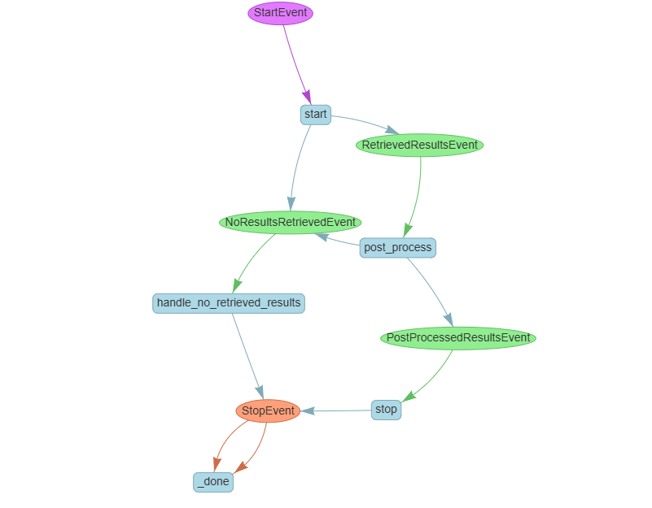

# RAGBot

RAGBot is a Retrieval-Augmented Generation (RAG) chatbot application built with Python, Streamlit, and LlamaIndex. It leverages vector search and large language models to answer questions based on our own data.

## Overview & Approach

RAGBot uses a Retrieval-Augmented Generation (RAG) architecture: it retrieves relevant information from a knowledge base (FAQ-style JSON) using vector search, then generates answers using a large language model (LLM) via OpenRouter. This approach ensures responses are both accurate and grounded in your organization's data.


**Integration with Other Systems:**  
RAGBot can be deployed as a backend service or as a web app. For a end user using this application (say, patient-facing mobile app), RAGBot can be exposed via an API endpoint, allowing the mobile app to send user queries and receive responses. The knowledge base can be regularly updated by the organization using the provided ingestion script.


## Features

- Ingests FAQ-style JSON data and builds a vector store index
- Uses LlamaIndex for document retrieval and OpenRouter for LLM responses
- Interactive web UI powered by Streamlit
- Shows sources for answers when responses are generated from retrieved documents
- Easily configurable via environment variables

## Project Structure
The following modules and directories are explicitly shown to display a clear project structure, as one would expect at the start of a new project:

```
.
├── app.py                # Streamlit web app entry point
├── ingest.py             # Script to ingest data and build index
├── .env                  # Environment variables (not committed)
├── data/                 # Directory for input data (e.g., faq_data.json)
├── models/               # Model cache directory
├── src/ragbot/           # Core package code
├── storage/              # Persisted vector/index/doc stores (not committed)
├── tests/                # Unit tests (not implemented yet)
├── pyproject.toml        # Project metadata and dependencies
└── README.md             # This file
```

# RAG Workflow Explanation

This document explains the workflow implemented in `rag_workflow.py` using the diagram `workflow.PNG`.

---

## Workflow Overview

The RAG workflow processes a user question through several stages:

1. **User submits a question**  
   ⬇️  
2. **Retrieval**  
   - The system retrieves relevant documents from the vector store using similarity search.
   - If no results are found, it triggers a fallback response.
   ⬇️  
3. **Post-processing**  
   - Applies similarity cutoff to filter out less relevant results.
   - If no results remain after filtering, it triggers a fallback response.
   ⬇️  
4. **LLM Generation**  
   - The filtered results are formatted as context and sent to the LLM along with the user question.
   - The LLM generates the final answer.
   ⬇️  
5. **Response**  
   - The answer (and sources, if available) are returned to the user.

---

## Workflow Diagram



## Instructions to Run the Chatbot

### 1. Install Dependencies

You can use any Python environment manager (e.g., venv, Poetry, or Conda).  
**I used a Conda environment and it worked well, but you can use any tool you prefer.**

If using Conda:

```sh
conda create -n <my_env> python=3.12
conda activate <my_env>
poetry config virtualenvs.create false
```

Then install dependencies with Poetry:

```sh
poetry install
```

### 2. Configure Environment Variables

Rename or copy `.env.example` to `.env` and fill in the required values (here, OpenRouter API key):

```sh
cp .env.example .env
```

Edit `.env` to set your API keys and configuration.

### 3. Ingest Data

Place your FAQ-style JSON files in the `data/` directory (see `data/faq_data.json` for an example). Then run:

```sh
python ingest.py
```

### 4. Run the App

Start the Streamlit app:

```sh
streamlit run app.py
```

> **Note:**  
> `app.py` (the Streamlit app) is what end users interact with.  
> `ingest.py` is managed by the organization to prepare and update the knowledge base.


## Assumptions & Trade-offs

- Assumes input data is in the form of json file in `data/` directory.
- Uses OpenRouter for LLM access; you must provide your own API key.
- The chatbot is stateless: it has no memory of previous questions or answers. Each user query must be entered as a standalone question.
- Streamlit is used for rapid prototyping and demo purposes; for production, a more robust web framework or API layer may be preferable.


## How to Expand This Project
- **Memory Module:** Implement a memory module to enable seamless conversational context, allowing the chatbot to remember previous interactions.
- **Query Refinement:** Add mechanisms to refine or clarify user queries for improved retrieval and answer quality.
- **Vector Databases:** Integrate a vector database (e.g., Pinecone, FAISS, Weaviate) for efficient and scalable hybrid search.
- **Answer Quality & Hallucination Checks:** Implement methods to detect and reduce hallucinations, ensuring the quality and factual accuracy of generated answers.
- **Reranking System:** Add a reranking step after retrieval to prioritize the most relevant documents or answers.
- **Intelligent Agent System:** Enable an agent-based routing mechanism and empower it with specialized tools for complex tasks.
- **API Layer:** Add a REST API (e.g., FastAPI) for integration with mobile/web apps.
- **User Authentication:** Integrate OAuth-based authentication for user identification.
- **Knowledge Base Management:** Build an admin UI for uploading and managing documents.
- **Multi-language Support:** Add translation or multilingual embeddings.
- **Analytics:** Track user queries and feedback for continuous improvement.
- **Unit & Integration Tests:** Expand the `tests/` directory with real tests.


## Monitoring in Production

- **Logging:** Add structured logging for all user queries and system errors.
- **Health Checks:** Implement health endpoints and monitor with tools like Prometheus.
- **Usage Metrics:** Track API usage, latency, and error rates.
- **Alerting:** Set up alerts for failed ingestions, high error rates, or LLM downtime.
- **Feedback Loop:** Allow users to flag incorrect answers for review.

---

## Environment Variables

See [.env.example](.env.example) for required variables. Typical variables include:

- `OPENROUTER_API_KEY` – Your OpenRouter API key


**Author:** Rakesh Reddy Kondeti

**Contact:** kondetirakeshreddy@gmail.com